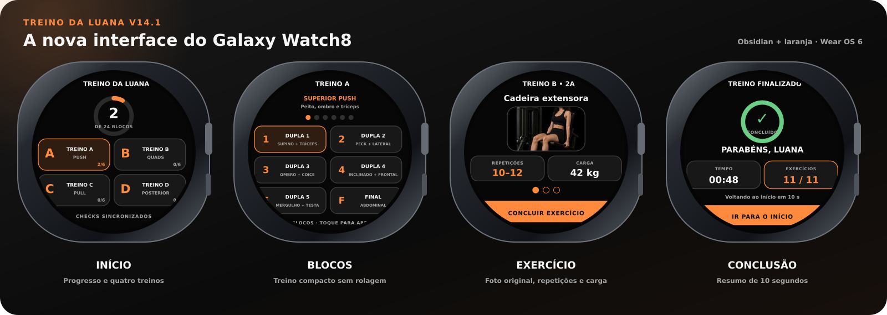
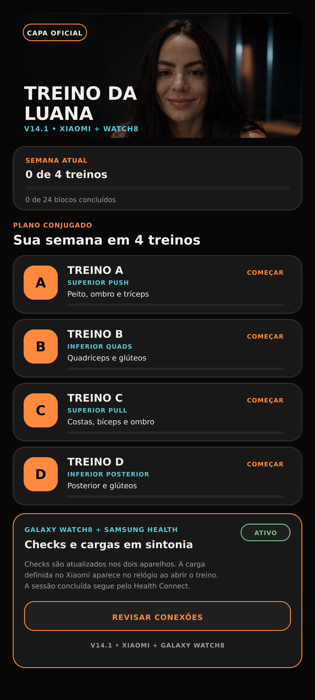
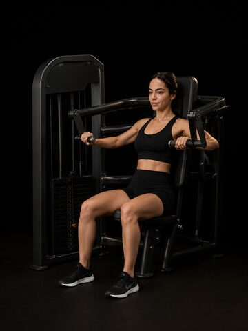
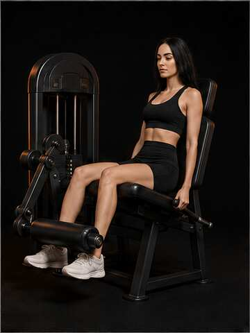
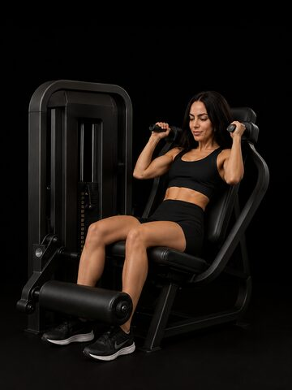

# Simbora

Aplicativo de treino pessoal que evoluiu de um APK simples para uma experiência integrada entre Android, Galaxy Watch8 e Health Connect.

> A proposta é simples: abrir o treino, saber exatamente o que fazer, registrar o que foi concluído e sair da academia sem depender de planilha, papel ou memória.

## Simbora Computer

A apresentação interativa do projeto está em `docs` e foi desenhada como uma pequena central de produto, no estilo “computer”, para navegar pela ideia, treinos, experiência, integrações, relógio e evolução das versões.

**Página:** https://ramosrabelo-ia.github.io/app-watch-smsaung-android-xiaomi-treinos/

## Interfaces V14.1

<p align="center">
  
</p>

<p align="center">
  
</p>

## Jornada da usuária

### 1. Abrir o app e entrar no treino

A experiência começa com a capa oficial e um resumo da semana. A pessoa vê os quatro treinos e escolhe onde continuar.

### 2. Escolher o foco do dia

A V14.1 organiza a semana em quatro treinos: dois de superiores e dois de inferiores.

<table>
  <tr>
    <td align="center"><strong>A · Superior Push</strong><br><sub>Peito, ombro e tríceps</sub><br><br></td>
    <td align="center"><strong>B · Inferior Quads</strong><br><sub>Quadríceps e glúteos</sub><br><br></td>
    <td align="center"><strong>C · Superior Pull</strong><br><sub>Costas, bíceps e posterior de ombro</sub><br><br></td>
    <td align="center"><strong>D · Inferior Posterior</strong><br><sub>Posterior de coxa e glúteos</sub><br><br></td>
  </tr>
</table>

### 3. Executar as duplas conjugadas

Cada treino possui cinco duplas conjugadas e um finalizador. A lógica é fazer o exercício A, seguir para o B e descansar somente depois dos dois.

<table>
  <tr>
    <td align="center"><strong>1A · Supino na máquina</strong><br><br></td>
    <td align="center"><strong>1B · Tríceps francês com halter</strong><br><br></td>
  </tr>
</table>

O app mostra ordem, séries, repetições, foto do movimento, dica de execução e controle do descanso. As imagens ficam incorporadas ao APK para funcionar mesmo sem internet.

### 4. Fechar o treino

Depois das cinco duplas, cada sessão termina com um finalizador abdominal. O progresso fica registrado por bloco e por treino para compor o resumo semanal.

<p align="center">
  
</p>

### 5. Registrar o treino concluído

Ao concluir a sessão, o Simbora pode gravar o treino de força no Health Connect. A integração é opcional e utiliza apenas permissão de escrita de exercício. O aplicativo não lê dados de saúde e não envia informações para servidor próprio.

```text
Simbora
   ↓
Treino concluído
   ↓
Health Connect
   ↓
Samsung Health, quando a integração estiver autorizada
```

### 6. Continuar no Galaxy Watch8

A V14.1 inclui um aplicativo Wear OS independente. No relógio é possível consultar os quatro treinos, ver a foto original, repetições e carga, concluir os exercícios e receber o resumo final diretamente no pulso. Checks são sincronizados nos dois sentidos; cargas definidas no Xiaomi aparecem automaticamente ao abrir o treino.

```text
Celular Xiaomi                   Galaxy Watch8
┌──────────────────┐            ┌──────────────┐
│ treino completo  │            │ treino A B C D│
│ fotos offline    │            │ dupla atual   │
│ progresso semanal│            │ check-in      │
│ Health Connect   │            │ finalizador   │
└──────────────────┘            └──────────────┘
```

## O produto hoje

A V14.1 reúne **4 treinos**, **24 blocos**, **44 exercícios com fotos offline nos dois aparelhos**, carga sincronizada, progresso semanal, cronômetro de descanso, resumo final e registro opcional no Health Connect.

## Evolução

`V5–V7` estrutura funcional e estabilidade

`V8–V9` entrada das imagens dos exercícios

`V10` visual Premium Obsidian e progresso semanal

`V11` experimentos de conectividade

`V12` treinos conjugados, 44 fotos offline, Health Connect e Galaxy Watch8

`V13` sincronização de checks entre Xiaomi e Watch8

`V14.1` nova interface do Watch8, fotos, cargas sincronizadas, resumo final e correção de compatibilidade no Xiaomi

## Estrutura principal

`treino-da-luana/v14/app` contém o aplicativo Android.

`treino-da-luana/v14/wear` contém o aplicativo Wear OS.

`docs` contém o Simbora Computer para GitHub Pages.

`.github/workflows/build-treino-da-luana-v14.yml` valida os APKs do celular e do relógio.

## Privacidade

Este é um projeto pessoal. A integração com Health Connect grava apenas uma sessão de exercício concluída quando autorizada. Não existe backend próprio para coleta de dados de saúde.
