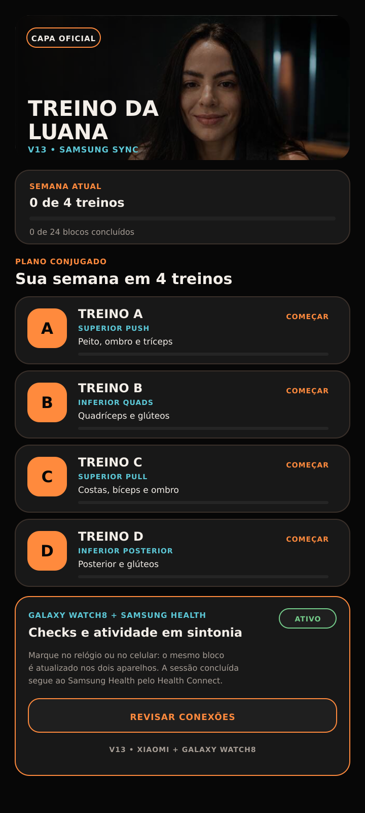
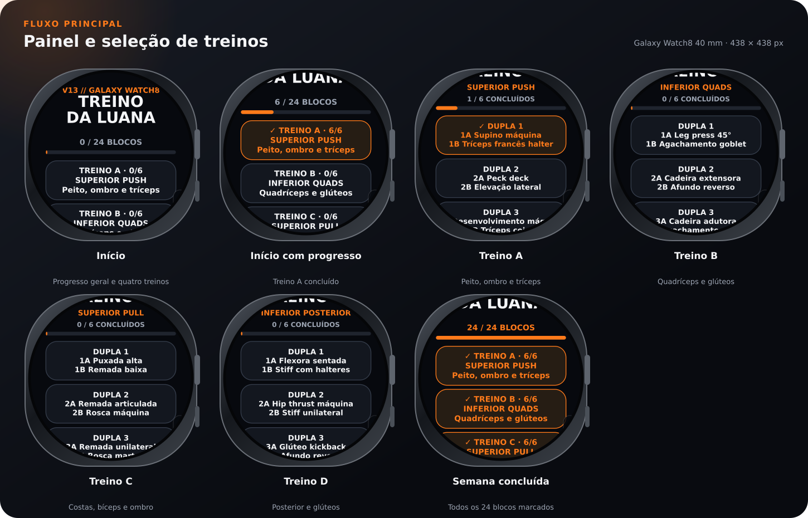

# Treino da Luana V13

Aplicativo de treino conjugado para Android + Samsung Galaxy Watch8. A V13 mantém o visual Premium Obsidian, as fotos e as cargas no celular, e transforma o relógio em um controle simples dos 24 blocos semanais.

## O que a V13 entrega

- quatro treinos: dois superiores e dois inferiores
- cinco duplas conjugadas + um abdominal final em cada treino
- 44 fotos locais, disponíveis mesmo sem internet
- séries, descanso, carga persistente e progresso semanal no celular
- painel compacto com todos os exercícios no Galaxy Watch8
- check bidirecional: marcou no relógio, aparece no celular; marcou no celular, aparece no relógio
- registro opcional do treino concluído no Samsung Health por meio do Health Connect
- zero notificações artificiais no relógio e nenhum servidor próprio

## Telas

| Celular Android | Execução da dupla |
|---|---|
|  |  |



[Treino A](docs/screenshots/watch-workout-a.svg) · [Treino B](docs/screenshots/watch-workout-b.svg) · [Treino C](docs/screenshots/watch-workout-c.svg) · [Treino D](docs/screenshots/watch-workout-d.svg)

## Como a sincronização funciona

1. Cada treino possui seis blocos, totalizando 24 checks por semana.
2. Celular e relógio usam o mesmo identificador de aplicativo e a mesma assinatura.
3. Um check cria um `DataItem` urgente no Wear OS Data Layer.
4. O outro aparelho recebe, compara o horário da alteração e aplica a versão mais recente.
5. Se os aparelhos estiverem temporariamente desconectados, o Wear OS guarda a mudança e entrega quando a conexão voltar.
6. Ao concluir o último abdominal, o celular pode gravar uma `ExerciseSessionRecord` no Health Connect; o Samsung Health recebe essa sessão conforme as permissões escolhidas pela usuária.

As cargas não são enviadas ao relógio. Elas continuam salvas somente no celular.

## Tecnologia

- Java 17: interface Android, interface Wear OS e sincronização
- Kotlin: ponte com o Health Connect
- Android SDK 36 / target 35
- Google Play services Wearable `20.0.1`
- Health Connect `1.1.0`
- Gradle + GitHub Actions
- Android Views construídas diretamente em código, sem servidor e sem login

## Estrutura

```text
app/    aplicativo Android para o Xiaomi
wear/   aplicativo Wear OS para o Galaxy Watch8
docs/   telas, instalação, privacidade e jornada
```

As 44 fotos são reaproveitadas de `../v12/app/src/main/assets`: continuam dentro do APK e disponíveis offline, mas não são duplicadas no histórico do GitHub. O ícone oficial fica versionado em Base64 para permitir a publicação textual e é reconstruído automaticamente antes da compilação.

## Compilar

Use Gradle 8.11.1 com JDK 17:

```bash
gradle :app:assembleDebug :wear:assembleDebug
```

Saídas:

- `app/build/outputs/apk/debug/app-debug.apk`
- `wear/build/outputs/apk/debug/wear-debug.apk`

Para a sincronização funcionar, os dois APKs precisam ter o mesmo `applicationId` e ser assinados com a mesma chave. O arquivo local `signing.properties` e qualquer `.jks` são ignorados pelo Git e nunca devem ser publicados. Veja [signing.properties.example](signing.properties.example).

O workflow [build-treino-da-luana-v13.yml](../../../.github/workflows/build-treino-da-luana-v13.yml) valida os dois módulos e publica APKs de teste com uma chave temporária comum. Esses artefatos servem para uma instalação nova do par. A atualização oficial que preserva os dados do Xiaomi deve ser assinada com a mesma chave privada da V12; essa chave nunca é publicada.

## Instalar e configurar

Veja o guia [docs/INSTALACAO.md](docs/INSTALACAO.md). A V13 atualiza o aplicativo já instalado no Xiaomi sem apagar cargas ou progresso. No relógio, a primeira instalação da edição sincronizada substitui a edição V12 independente.

## Privacidade

O aplicativo não lê frequência cardíaca, sono, peso ou localização. Ele escreve somente a sessão de treino concluída quando a usuária autoriza o Health Connect. Os checks transitam diretamente pelo Wear OS Data Layer entre os aparelhos pareados. Leia [docs/PRIVACIDADE.md](docs/PRIVACIDADE.md).

## A jornada

A história da V5 ao primeiro APK instalado no Galaxy Watch8 e à sincronização da V13 está em [docs/JORNADA.md](docs/JORNADA.md).

> Este é um aplicativo pessoal de organização de treino, não uma prescrição médica. Cargas e movimentos devem ser ajustados com um profissional quando necessário.
